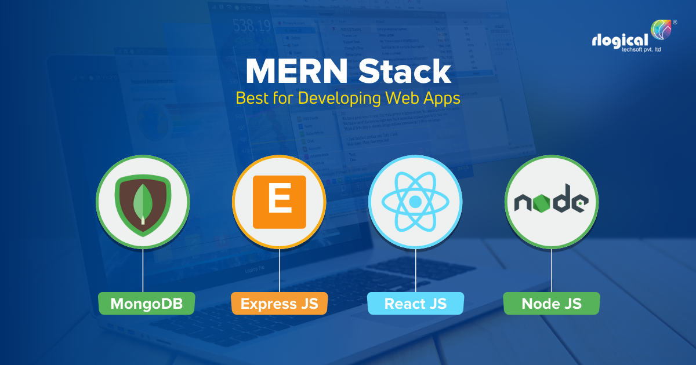

# Capstone Project

## Introduction of the Project
This project is to help the employees to work on the report and able to submit it to the managers for them to review, especially for the engineers.
At the Same, it is also easier for the user and admin to trace the file with the record.

## Technology applied in this project

The technologies applied in this project are as below:

- React - Frontend development!
- CSS , Style Component & React-Bootstrap
- Redux Toolkit for state management
- MongoDB , Nodejs & Express.

